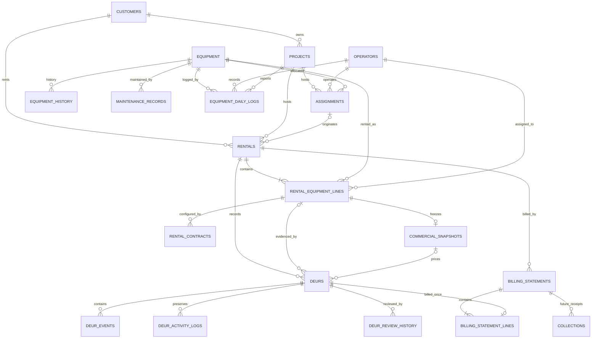

# Production Database Design

## Scope

This is the Phase 10 relational target for PostgreSQL. The running application remains on Local Storage. No repository, service, UI, or business rule is changed by these files.

## Ownership and relationships

- An Assignment identifies one equipment/operator/project allocation.
- A Rental owns one or more Rental Equipment Lines. A line is the durable rental-to-equipment relationship and carries the canonical operator for that rented item.
- A Rental Contract configures commercial terms for a line before release.
- A Commercial Snapshot is immutable and unique per Rental Equipment Line. It is the billing authority after release.
- A DEUR belongs to a Rental and identifies its Rental Equipment Line, equipment, and operator. Legacy DEURs may temporarily have a null line ID during controlled import reconciliation.
- Legacy DEUR activity logs and canonical DEUR events are stored separately and remain immutable; no evidence conversion is assumed by this design.
- A Billing Statement owns immutable Billing Statement Lines. Each line identifies the effective DEUR and copies all calculated monetary evidence used by the current billing model.
- `invoice_projection` exposes invoice-shaped rows without creating a competing invoice aggregate. Future collections can reference the billing statement.
- Equipment History and Audit Log are append-only evidence.
- Maintenance Records and Equipment Daily Logs are normalized operational children of Equipment; Daily Logs also reference Operator and Project.

## ER diagram

## Constraints and immutable evidence

Primary and foreign keys preserve current string IDs. Active assignment uniqueness prevents simultaneous active equipment/operator allocation. A rental cannot repeat equipment, one active contract is allowed per line, and one commercial snapshot is allowed per line. Date, nonnegative amount, percentage, status, event, evidence-mode, and revision checks mirror current domain validation.

Commercial snapshots and historical event/review/audit/history rows reject updates and deletes. Billing lines can change only while their statement is Draft. The unique DEUR and revision-chain indexes prevent duplicate billing; cancellation does not erase historical billing consumption.

## Precision

Use `numeric`, never floating point, for billing:

| Value | Type |
| --- | --- |
| Posted money and charges | `numeric(19,4)` |
| Unit/operator/overtime rates | `numeric(19,6)` |
| Quantities and estimated volume | `numeric(19,6)` |
| Hours and meter readings | `numeric(14,4)` / `numeric(19,4)` |
| Tax percentages | `numeric(9,6)` |

Rounding remains an application/domain responsibility until parity fixtures prove a database implementation identical.

## Audit, concurrency, and deletion

Mutable aggregates carry `created_at/by`, `updated_at/by`, and `row_version`. Future writes use compare-and-swap (`id` plus expected `row_version`); triggers increment the version and apply a server timestamp. Soft-deletable rows use `deleted_at/by`. Evidence tables are append-only rather than soft-deleted. All timestamps are `timestamptz`; business work dates remain `date`.

## Seed and import strategy

Only universal status lookups are idempotently seeded. Tenant/business masters and every transaction are imported from a verified Local Storage backup, retaining IDs and source timestamps. Unknown legacy fields remain in `legacy_payload` during the parity period. Import must run parent-first, reject orphaned foreign keys into a reconciliation report, calculate snapshot hashes, and compare entity counts and billing totals before cutover.

## Migration order

1. Deploy schema and functions (`001`).
2. Deploy Rental, commercial, and DEUR aggregates (`002`).
3. Deploy billing, invoice projection, history/audit, sync, and future foundations (`003`).
4. Enable immutability, concurrency triggers, and indexes (`004`).
5. Seed reference statuses (`005`).
6. Deploy import staging (`006`) and Maintenance/Daily Log targets (`007`).
7. In a future migration project only: import masters, equipment, assignments, rentals, lines, contracts/snapshots, DEUR evidence, billing, maintenance/logs, then audit/history.
8. Reconcile counts, foreign keys, hashes, DEUR revision chains, and statement totals; perform rollback rehearsal before any adapter cutover.

## Index rationale

The schema indexes current lookup paths: active equipment/project status, assignment dates, rental customer/project status and dates, line status, contracts by rental, DEUR by rental/line/operator/date and billing readiness, DEUR event chronology, statements by rental period/invoice state, statement lines by equipment/date, history/audit chronology, and pending outbox work. Production query plans and cardinality—not guesses—must drive additional indexes.

## Compatibility and synchronization

Nullable line/snapshot references exist only where legacy records can lack them. They must not be used for newly created records after cutover. `sync_outbox` supports idempotency, expected versions, retries, and manual reconciliation. `sync_cursors` supports resumable consumers. Server-generated timestamps become authoritative after synchronization; client timestamps remain evidence in payload metadata.
